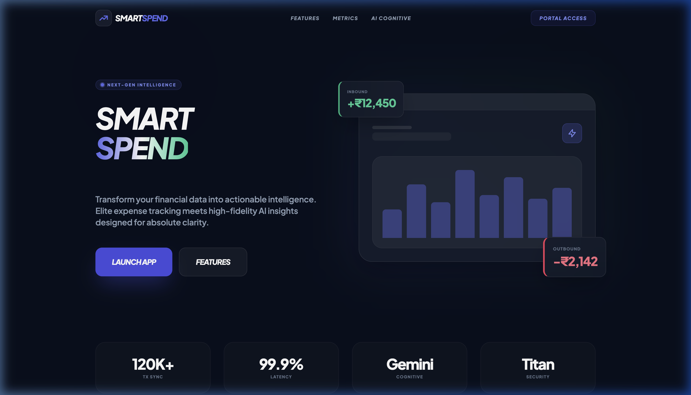
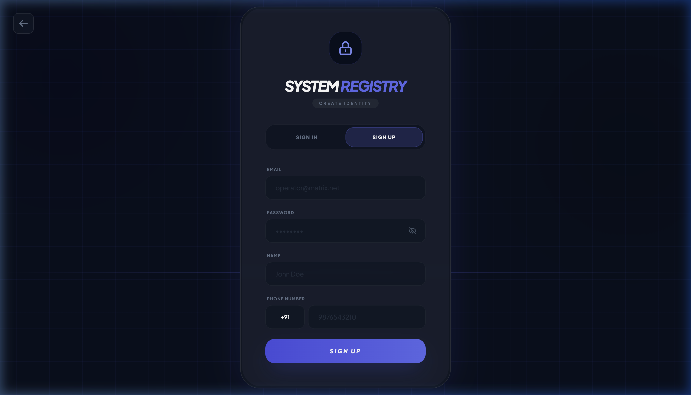
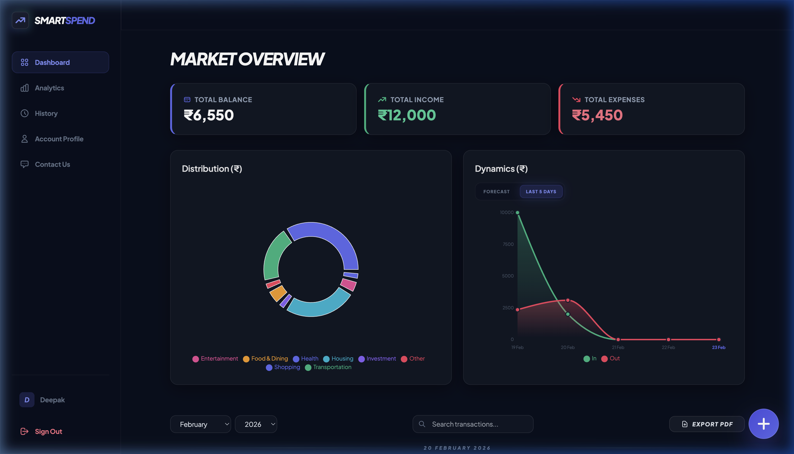
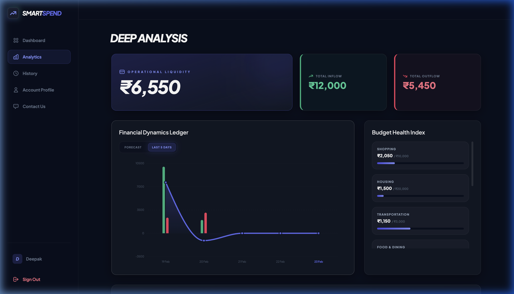
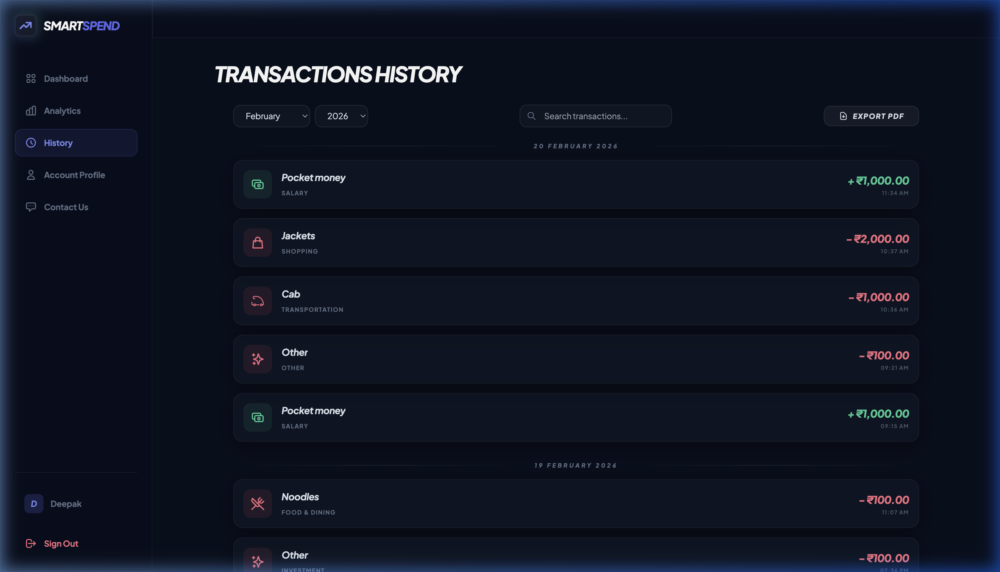
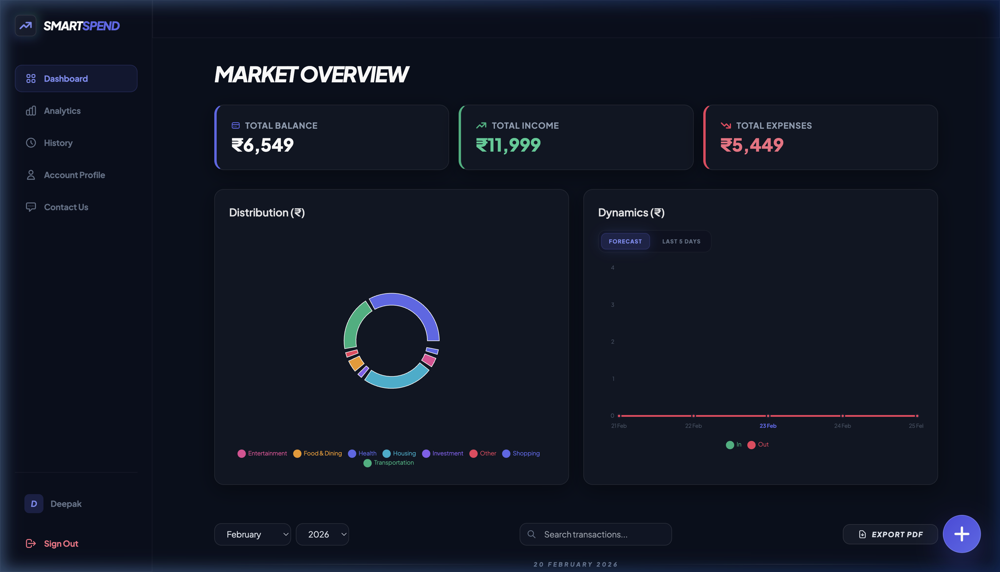

# SmartSpend | AI Financial Intelligence 🍱📉

SmartSpend is a premium, AI-powered financial management application designed for high-performance expense tracking and predictive financial forecasting. Featuring a sleek, dark-mode glassmorphic interface, it brings state-of-the-art visual intelligence to your personal finances.





## ✨ Key Features

- **🤖 AI Financial Insights**: Automated analysis of your spending habits with personalized recommendations.
- **📊 Advanced Visualizations**: 
  - **Dynamic Ledger**: High-contrast charts for tracking "Inbound" (Income) and "Outbound" (Expenses) flows.
  - **Categorical Concentration**: Large, interactive distribution charts for instant budget clarity.
- **⚡ High-Performance UX**: 
  - Glassmorphic design with subtle micro-animations (Framer Motion).
  - Rapid transaction entry and real-time ledger updates.
- **🔴 Contrast-Focused Ledger**: Outbound transactions are highlighted in red for instant spending recognition.
- **📱 SEO & Social Ready**: Fully optimized for search engines and social sharing previews.

## 🖼️ Visual Demo

### Dashboard Overview
The main command center featuring your balance summary and predictive dynamics.


### In-Depth Analytics
Deep-dive into your financial sectors with interactive ledger consistency.


### Transaction Ledger
A high-precision, searchable history of all your financial movements.


### Financial Summary
Get a high-level view of your total wealth status.


## 🛠️ Tech Stack

- **Frontend**: React 19 + Vite
- **Styling**: Tailwind CSS + Custom Glassmorphism
- **Animations**: Framer Motion
- **Charts**: Recharts
- **Backend**: Supabase (PostgreSQL)
- **Deployment**: Vercel

## 🚀 Getting Started

### Prerequisites
- Node.js (v18 or higher)
- npm or yarn

### Installation

1. Clone the repository:
   ```bash
   git clone https://github.com/deepak1293g/SmartSpend.git
   ```

2. Install dependencies:
   ```bash
   npm install
   ```

3. Configure environment variables:
   Create a `.env.local` file and add your keys:
   ```env
   VITE_SUPABASE_URL=your_supabase_url
   VITE_SUPABASE_ANON_KEY=your_supabase_key
   VITE_GEMINI_API_KEY=your_gemini_key
   ```

4. Launch the development server:
   ```bash
   npm run dev
   ```

## 🌐 SEO & Deployment
Triggered automatically via GitHub Actions upon pushing to `main`.
- **Live URL**: [https://smart-spend-ai.vercel.app/](https://smart-spend-ai.vercel.app/)

---
*Built with ❤️ for better financial futures.*
